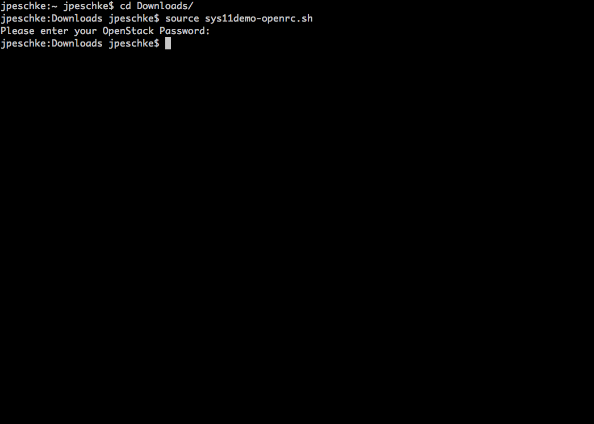

## Goal

* Authenticating to use the SysEleven Stack API
* Starting a sample stack using the SysEleven Stack API

## Prerequisites

* You need to have the login data for the SysEleven Stack API (user name and passphrase).
* The [OpenStack CLI-Tools](../../03.Howtos/02.openstack-cli/docs.en.md) are installed in an up-to-date version.
* Knowledge how to utilise a terminal/SSH and SSH-keys.

## Accessing the SysEleven Stack API

To work with the SysEleven Stack API you need to set environment variables used by the command line tools to authenticate and authorize your API calls. Users logged into the [Dashboard](https://dashboard.cloud.syseleven.net) can download a file that helps setting these variables under *Compute* --> *Access & Security* --> *API Access*. There you can click on *Download OpenStack RC File v3* to download the corresponding file.


## Setting up the environment variables

To provide the clients with the parameters for authentication and authorization use (Username/Password/Project-Scope) for the corresponding session we have to source the downloaded file and type our OpenStack password:

```shell
source Downloads/sys11demo-openrc.sh
```



Sourcing this file to set up environment variables does not return output.

## Test API Access

We can now use the OpenStack command line client to check whether our access works:

```shell
syseleven:~ syseleven$ openstack network list
+--------------------------------------+---------+--------------------------------------+
| ID                                   | Name    | Subnets                              |
+--------------------------------------+---------+--------------------------------------+
| caf8de33-1059-4473-a2c1-2a62d12294fa | ext-net | 51a64106-3eb2-4172-9343-404a9f6b9993 |
+--------------------------------------+---------+--------------------------------------+
```

In this example you see a network pool which provides us with Floating IP addresses. This shows that you successfully used the SysEleven Stack API.

## Using infrastructure templates

Now you can use the OpenStack command line tools to control all the infrastructure components of the SysEleven Stacks (i.e., networks, security groups, virtual machines). To automate this, you can use Heat templates which are a structured representation of your setups. SysEleven provides examples that work with the SysEleven Stack on Github. Feel free to check them out!

Example setups can be copied as follows:

```shell
git clone https://github.com/syseleven/heat-examples.git
```

Now you can take the [LAMP-Setup](https://raw.githubusercontent.com/syseleven/heat-examples/master/lamp-server/) from our [single LAMP Server example](../03.single-lamp-server/docs.en.md) and start it using the API this time:

```shell
cd heat-examples/lamp-server
openstack stack create -t example.yaml --parameter key_name=sys11demokey lampstack
```