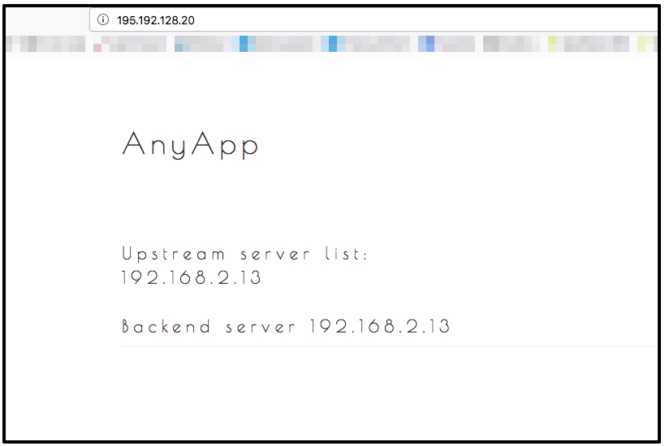

## A TCP-based load balancer for your upstreams

### Overview

OpenStack provides load balancing through LoadBalancer as a Service (LBaaS).
This means that load balancing rules can be created directly within OpenStack.
No dedicated load balancer instance is required to use this service.

!!! **Feature availability**
!!! LBaaS was previously only available in region 'dbl'. It has become also available in region 'cbk' in February 2019.

## Prerequisites

* You should be able to use simple heat templates, like shown in the [first steps tutorial](../01.firststeps/docs.en.md).
* You know the basics of using the [OpenStack CLI-Tools](../../03.Howtos/02.openstack-cli/docs.en.md).
* Environment variables are set, like shown in the [API-Access-Tutorial](../02.api-access/docs.en.md).

## How to setup a TCP LoadBalancer

In this tutorial we demonstrate an LBaaS setup with the following features:

* a TCP load balancer
* Round Robin LB algorithm
* Health Monitor for LB pool members (upstream instances)
* a server group with dynamic number of servers
* every upstream node installs Apache2 and PHP7.0 FPM via HEAT
* "Anyapp" as simple PHP application

### Clone git repository

We use a heat code example that we provide [on Github](https://github.com/syseleven/heat-examples).

```shell
git clone https://github.com/syseleven/heat-examples.git
```

### Step one: Create the stack

Open the folder containing the example code and create the stack providing your SSH key and the stack name.

```shell
$ cd heat-examples/LBaaS

# openstack stack create -t lbstack.yaml --parameter key_name=<publicKeyName> <stackName>

$ openstack stack create -t lbstack.yaml --parameter key_name=exampleuser examplelb
+---------------------+--------------------------------------+
| Field               | Value                                |
+---------------------+--------------------------------------+
| id                  | f1ef864b-4acc-4e32-ac92-43c3551b794b |
| stack_name          | examplelb                            |
| description         | A Group of Load Balanced Servers     |
| creation_time       | 2018-03-01T10:03:48Z                 |
| updated_time        | None                                 |
| stack_status        | CREATE_IN_PROGRESS                   |
| stack_status_reason | Stack CREATE started                 |
+---------------------+--------------------------------------+
```

### Step Two: Assign security group to load balancer

<div class="alert alert-dismissible alert-info">
    <h4 class="alert-heading">Port updates</h4>
    Port-Updates can't be done in heat at the moment:<br>
    [This link](https://blueprints.launchpad.net/heat/+spec/add-security-group-to-port) provide more information on this.
</div>

After a successful launch the whole setup will not be reachable from the outside until
you bind a valid security group to the load balancer port.

Ports can be assigned as follows:

```shell
openstack port set --security-group <Security Group> <LoadBalancer Port>
```

There is an output section that gives you the abilty to assign the correct security group to.

To simplify this process the example stack gives you a vaild openstack command in the output section.

```shell
openstack stack show <stackName> -f value -c outputs | grep -i 'port set'
```

### Step Three: Check if the load balancer works properly

The example code contains the LB floating IP in its output:

```shell
# openstack stack show <stack name> -f value -c outputs

$ openstack stack show examplelb -f value -c outputs
[
  {
    "output_value": "http://195.192.128.20:80",
    "output_key": "lburl",
    "description": "This URL is the \"external\" URL that can be used to access the load balancer.\n"
  },
  {
    "output_value": "openstack port set --security-group 11764de3-3889-4be7-9627-3fb2e9431de1 447617cf-5818-4007-9909-ec3cf3fe4912",
    "output_key": "sec_group_connection",
    "description": "This command can be used to connect security groups to the  load balancer port. After the LB is accessible from the outside."
  }
]
```

To retrieve only the URL use the following command:

```shell
# openstack stack show <stack name> -f value -c outputs | grep -i 'http:' | cut -f2- -d:

$ openstack stack show examplelb -f value -c outputs | grep -i 'http:' | cut -f2- -d:

"http://195.192.128.20:80",
```

Open Anyapp in your browser via `http://<loadbalancerIP>` which shows the IP of the currently-used backend server.
Open Anyapp in other tabs/windows to see the load balancer working.



## Conclusion

You should now be able to adopt this example to your needs.
The obvious things to change are the upstream servers, the overall architecture should work for many scenarios.

