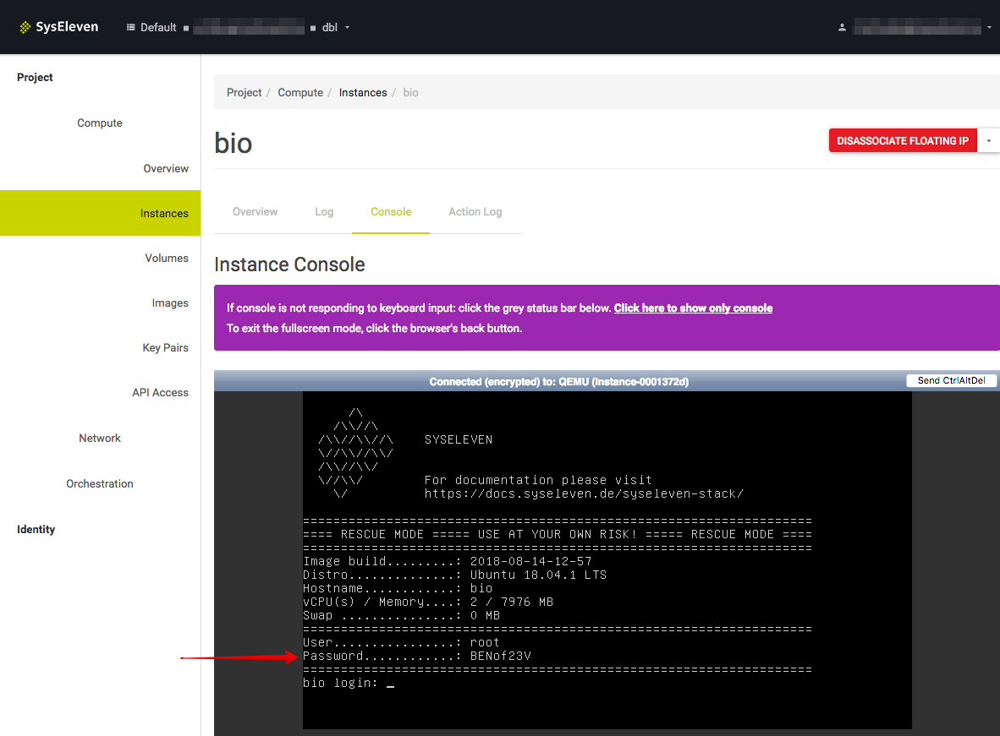
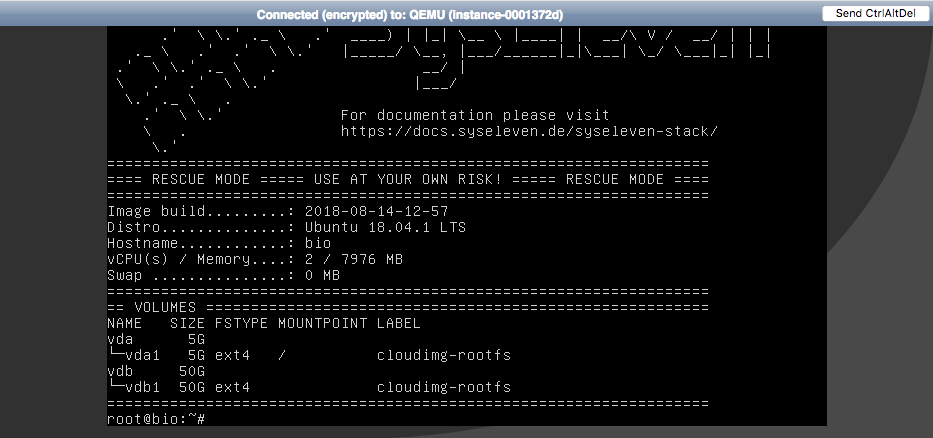

## Das SysEleven Rescue Image

Die Rescue Images wurden basierend auf Ubuntu 16.04 und 18.04 LTS als Kern System gebaut und getestet.
Sie enthalten vorinstallierten Tools um Instanzen zu retten und unterstützen die meisten Dateisysteme "out-of-the-box".

!!! Da die Rescue Images regelmäßig neu gebaut werden ist es empfehlenswert immer die [aktuelle Image ID oder den Image Namen abzufragen](#nova-rescue-modus-starten).

## Ziel

* Den Nova rescue Modus für eine Instanz aktivieren
* Das (Datei)System reparieren und falls benötigt Daten exportieren

## Vorraussetzungen

* Der Umgang mit einfachen Heat-Templates, wie [in den ersten Schritten](../../02.Tutorials/01.firststeps/docs.en.md) gezeigt, wird vorausgesetzt.
* Grundlagen zur Bedienung des [OpenStack CLI-Tools](../../03.Howtos/02.openstack-cli/docs.de.md).
* Umgebungsvariablen gesetzt, wie im [API-Access-Tutorial](../../02.Tutorials/02.api-access/docs.en.md) beschrieben.

## Optional: Temporäre Arbeitsumgebung

<details/>
<summary>Hier klicken um Details einzublenden</summary>

### Temporäre Arbeitsumgebung

Für dieses Tutorial benötigen wir eine *Linux-Umgebung* mit OpenStack Client. Sollte diese noch nicht vorhanden sein, kann sie mit folgenden Kommandos erstellt werden:

```shell
wget https://raw.githubusercontent.com/syseleven/heat-examples/master/kickstart/kickstart.yaml
...
openstack stack create -t kickstart.yaml --parameter key_name=<ssh key name> <stack name> --wait
...
```

Nun müssen wir uns zur erstellten Instanz verbinden.

```shell
ssh syseleven@<server-ip>
```

Alle folgenden Kommandos werden hier ausgeführt.

Wir benötigen auch die OpenStack Zugangsdaten (openrc-Datei).
Diese kann [hier](https://dashboard.cloud.syseleven.net/horizon/project/access_and_security/api_access/openrc/) heruntergeladen werden.

```shell
source openrc
```

</details>

## Nova Rescue Modus starten

Damit wir uns mit dem Instanz Volume verbinden zu können müssen wir den Nova Rescue Modus starten.
Dafür verwenden wir ein *Rescue Image*, das SysEleven in OpenStack zur Verfügung stellt.

Zuerst stoppen wir die Instanz

```shell
openstack server stop <server uuid>
```

Dann benötigen wir die aktuelle ID vom Rescue Image

```shell
$ openstack image list --public | grep -i rescue

| fsf3af07-8ru.......... | Rescue Ubuntu 16.04 sys11   | active |
| ace507db-7ac.......... | Rescue Ubuntu 18.04 sys11   | active |
```

<div class="alert alert-dismissible alert-info">
    OpenStack Client Version 3.13.x ist die minimale Version um Instanzen im Rescue Modus starten zu können.
</div>

Danach starten wir die Instanz mit dem Rescue Image

```shell
# openstack server rescue --image < Image name / ID > <server name / uuid>

openstack server rescue --image "Rescue Ubuntu 18.04 sys11" app001
```

Bitte ein paar Sekunden warten, während das Rescue Image startet.

## In die Nova Rescue Instanz einloggen

Nachdem Einloggen können wir mit dem Rescue Modus arbeiten.

### via SSH

Falls beim initialen Deployen der Instanz ein SSH key verwendet wurde ist der Login via SSH möglich

```shell
ssh ubuntu@<Instance floating ip>
```

### via Console

Das Rescue Image generiert beim jedem Start ein zufälliges Root Passwort, welches über die Console eingesehen werden kann. Der Root User kann sich ausschließlich über die Console anmelden. Dort kann für den Systemuser "ubuntu" ein Kennwort gesetzt werden, falls kein SSH Key verfügbar ist und der Login via SSH gewünscht ist.

Das Root Passwort auslesen:



Mit dem Root Passwort anmelden:



## Mit der Nova rescue Instanz arbeiten

Root Benutzer werden und nach angehängen Block Devices schauen. Dann wird das Dateisystem eingehängt.

```shell
$ sudo -i
$ lsblk

NAME   MAJ:MIN RM SIZE RO TYPE MOUNTPOINT
vda    253:0    0   5G  0 disk
└─vda1 253:1    0   5G  0 part /
vdb    253:16   0  50G  0 disk
└─vdb1 253:17   0  50G  0 part

$ mount /dev/vdb1 /mnt/
```

Jetzt können wir mit dem Reparieren beginnen.  
Mit `fsck` können etwaige Fehler erkannt und repariert werden.

```shell
# Using the option -y, fsck will repair without asking.
$ sudo fsck -f /dev/vdb1
[...]
```

Mit `testdisk` können z.B. Dateien in defekten Dateisystemen gesucht werden.

```shell
$ sudo testdisk /dev/vdb1

TestDisk 7.0, Data Recovery Utility, April 2015
Christophe GRENIER <grenier@cgsecurity.org>
http://www.cgsecurity.org

  TestDisk is free software, and
comes with ABSOLUTELY NO WARRANTY.

Select a media (use Arrow keys, then press Enter):
>Disk /dev/vdb1 - 53 GB / 49 GiB


>[Proceed ]  [  Quit  ]

Note: Disk capacity must be correctly detected for a successful recovery.
If a disk listed above has incorrect size, check HD jumper settings, BIOS
detection, and install the latest OS patches and disk drivers.

[...]
```

## Nova Rescue Modus stoppen

Zuerst "unrescue"(en) wir die Instanz.

```shell
openstack server unrescue <server uuid>
```

Danach starten wir die Instanz wieder.

```shell
openstack server start <server uuid>
```

## Zusammenfassung

* Wir haben über den Rescue Modus Zugriff auf das System/die Dateien.
* Die Daten sind nun unter `/mnt/` verfügbar.
* Bei ext-Dateisystemen sollte ein Blick in `/mnt/lost+found` geworfen werden.
