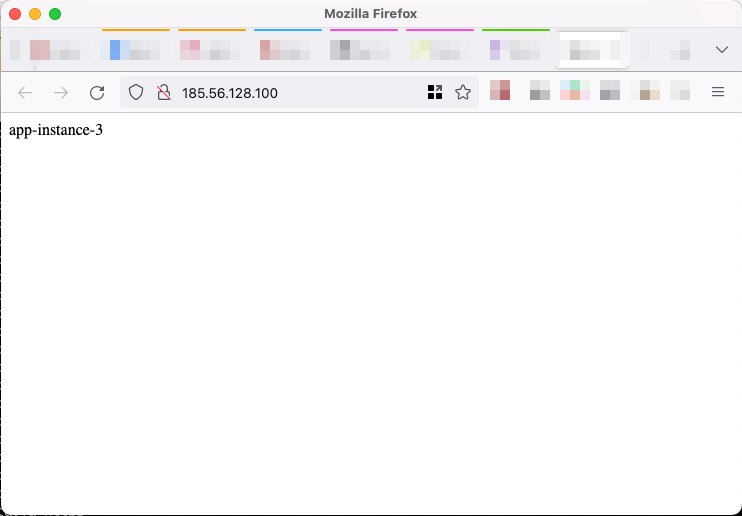

## Overview

SysEleven Stack provides load balancing through Load Balancer as a Service (LBaaS).

Currently the SysEleven Stack provides two APIs/services for Load Balancers: Octavia LBaaS and Neutron LBaaSv2. With the Neutron variant the SysEleven Stack only supports TCP-based load balancers, whereas with Octavia also HTTP and HTTPS are supported.

Please refer to our reference documentation for a more [detailed comparison between Octavia LBaaS and Neutron LBaaS](../../04.Reference/08.network/02.lbaas/docs.en.md).

Below you will find two tutorials in two variants: how to set up an HTTP load balancer (using Octavia load balancers) and how to set up a simple TCP load balancer (this time with Neutron load balancers).

[ui-tabs position="top-left" active="0" theme="lite"]
[ui-tab title="Terraform"]

## Prerequisites

* You have installed [Terraform](https://learn.hashicorp.com/tutorials/terraform/install-cli).
* You know the basics of using the [OpenStack CLI-Tools](../../03.Howtos/02.openstack-cli/docs.en.md).
* Environment variables are set, like shown in the [API-Access-Tutorial](../02.api-access/docs.en.md).

## Git repository with Terraform examples

The Terraform examples used in the tutorials are [available on GitHub](https://github.com/syseleven/terraform-examples/tree/master/lbaas)

```shell
git clone https://github.com/syseleven/terraform-examples.git
```

This repository is used in both setups described below:

* terraform-examples/lbaas-octavia-http: contains the Terraform recipe for an HTTP load balancer set up using Octavia resources
* terraform-examples/lbaas: contains the Terraform template for a TCP load balancer set up using Neutron LBaaSv2 resources

## HTTP Load Balancer with Terraform and Octavia

In this tutorial we demonstrate an Octavia LBaaS setup (in Terraform they call it infrastructure) with the following features:

* an HTTP load balancer
* Round Robin LB algorithm
* Health Monitor for LB pool members (upstream instances)
* a server group with dynamic number of servers
* every upstream node installs nginx via Cloud-Init
* Nginx and a simple static page to show the identity of the back-end

### Step one: Create the infrastructure

Open the folder containing the example code and create the infrastructure, providing your SSH key.

```shell
$ source openrc  # Set OpenStack authentication environment variables
$ cd terraform-examples/lbaas-octavia-http
$ terraform init

Initializing the backend...

...etc...

$ terraform plan -var ssh_publickey="ssh-rsa AAA...== user@example.com" -out planfile
```

Alternatively, you can make a file which contains your variables. It would look like this:

```plain
# Please change the ssh public keys below to yours
ssh_publickey = "ssh-rsa AAAA...== user@example.com"
```

Then, plan and apply the Terraform infrastructure.

```shell
$ terraform plan -var-file=env.tfvars -out planfile

$ terraform apply planfile
openstack_compute_keypair_v2.keypair: Creating...
openstack_compute_secgroup_v2.sg_ssh: Creating...
openstack_networking_router_v2.router_lbdemo: Creating...
openstack_networking_floatingip_v2.fip_lbdemo_jumphost: Creating...
openstack_networking_network_v2.net_lbdemo: Creating...
openstack_networking_floatingip_v2.fip_lbdemo_lb: Creating...
openstack_compute_secgroup_v2.sg_web: Creating...
openstack_compute_keypair_v2.keypair: Creation complete after 1s [id=keypair]
openstack_compute_secgroup_v2.sg_web: Creation complete after 2s [id=a65c71be-b694-4695-92d9-f310caad86b5]
openstack_compute_secgroup_v2.sg_ssh: Creation complete after 2s [id=422d4735-7d38-4817-ada7-a7ea61c42b35]
...
openstack_lb_member_v2.lb_app_pool_members[1]: Creation complete after 10s [id=02013468-5fa1-4cbc-87f1-5bfd422a4b3a]
openstack_lb_member_v2.lb_app_pool_members[2]: Creation complete after 11s [id=85c42f97-ab31-45aa-9699-5175e86e36f7]
openstack_lb_member_v2.lb_app_pool_members[0]: Creation complete after 17s [id=bb59928c-f81c-4f13-a352-4f6b500ea8fc]

Apply complete! Resources: 22 added, 0 changed, 0 destroyed.

Outputs:

loadbalancer_http = "http://185.56.128.100"
```

Note that the "Allowed CIDRs" of the listeners in the example are already set to a value (here 0.0.0.0/0). This is in contrast to Heat, where you have to set them in a separate step. The security groups are also configured in the Terraform recipe.

### Step two: Check if the load balancer works properly

The call to `terraform apply` contains the LB floating IP in its output:

```shell
Apply complete! Resources: 22 added, 0 changed, 0 destroyed.

Outputs:

loadbalancer_http = "http://185.56.128.100"
```

Open AnyApp in your browser via `http://<loadbalancerIP>` which shows the IP of the currently-used backend server.
Open AnyApp in other tabs/windows to see the load balancer working.



## TCP Load Balancer with Terraform and Neutron LBaaSv2

With Neutron LBaasV2 only TCP-based load balancing is supported.
With Terraform, you can attach a security group to the load balancer VIP port as part of creating the infrastructure (with Heat that would be a separate step).

In this tutorial we demonstrate a Neutron LBaaSv2 infrastructure with the following features:

* a TCP load balancer
* Round Robin LB algorithm
* Health Monitor for LB pool members (upstream instances)
* a server group with dynamic number of servers
* every upstream node installs Apache2 and PHP7.4 FPM via Cloud-Init
* "AnyApp" as simple PHP application

### Step one: Create the infrastructure

```shell
$ source openrc  # Set OpenStack authentication environment variables
$ cd terraform-examples/lbaas
$ terraform init
$ terraform plan -var ssh_publickey="ssh-rsa AAA...user@example.com" -out planfile
$ terraform apply planfile
...
Outputs:

loadbalancer_http = "http://185.56.128.100"
```

### Step two: Check if the load balancer works properly

The example code contains the LB floating IP in its output:

```shell
# terraform output <Name Of The Output>

$ terraform output loadbalancer_http
"http://195.192.128.20"
```

Open AnyApp in your browser via `http://<loadbalancerIP>` which shows the IP of the currently-used backend server. Since this example installs more software on the backends than the previous example, it may take a minute before the AnyApp is available.
Open AnyApp in other tabs/windows to see the load balancer working.


[/ui-tab]
[ui-tab title="Heat"]

## Prerequisites

* You should be able to use simple heat templates, like shown in the [first steps tutorial](../01.firststeps/docs.en.md).
* You know the basics of using the [OpenStack CLI-Tools](../../03.Howtos/02.openstack-cli/docs.en.md).
* Environment variables are set, like shown in the [API-Access-Tutorial](../02.api-access/docs.en.md).

## Git repository with Heat template examples

The heat template examples used in the tutorials are available [on GitHub](https://github.com/syseleven/heat-examples).

```shell
git clone https://github.com/syseleven/heat-examples.git
```

This repository is used in both setups described below:

* heat-examples/lbaas-octavia-http: contains the heat template for an HTTP load balancer set up using Octavia resources
* heat-examples/lbaas: contains the heat template for a TCP load balancer set up using Neutron LBaaSv2 resources

## HTTP Load Balancer with Heat and Octavia

In this tutorial we demonstrate an Octavia LBaaS setup with the following features:

* an HTTP load balancer
* Round Robin LB algorithm
* Health Monitor for LB pool members (upstream instances)
* a server group with dynamic number of servers
* every upstream node installs Apache2 and PHP7.0 FPM via HEAT
* "Anyapp" as simple PHP application

### Step one: Create the stack

Open the folder containing the example code and create the stack providing your SSH key and the stack name.

```shell
$ cd heat-examples/lbaas-octavia-http

# openstack stack create -t lbstack.yaml --parameter key_name=<publicKeyName> <stackName>

$ openstack stack create -t lbstack.yaml --parameter key_name=exampleuser examplelb
+---------------------+--------------------------------------+
| Field               | Value                                |
+---------------------+--------------------------------------+
| id                  | f1ef864b-4acc-4e32-ac92-43c3551b794b |
| stack_name          | examplelb                            |
| description         | A Group of Load Balanced Servers     |
| creation_time       | 2018-03-01T10:03:48Z                 |
| updated_time        | None                                 |
| stack_status        | CREATE_IN_PROGRESS                   |
| stack_status_reason | Stack CREATE started                 |
+---------------------+--------------------------------------+
```

### Step two (optional): Set allowed CIDRs

By default the load balancer will accept connections from everywhere. In order to limit the incoming traffic to certain client IP address ranges you need to configure the listener with allowed CIDRs (one or multiple).
In our HEAT template example the listener's name is the stack name followed by "-listener", e.g. "examplelb-listener".

```shell
# openstack loadbalancer listener set --allowed-cidr 172.20.0.0/16 --allowed-cidr 10.0.0.0/8 <listener name>

$ openstack loadbalancer listener set --allowed-cidr 172.20.0.0/16 --allowed-cidr 10.0.0.0/8 examplelb-listener
```

It is not possible to remove individual CIDRs, so you have to overwrite the list of CIDRs with the new complete list. Or set it explicitly to 0.0.0.0/0 to allow access to everyone again.

### Step three: Check if the load balancer works properly

The example code contains the LB floating IP in its output:

```shell
# openstack stack show <stack name> -f value -c outputs

$ openstack stack show examplelb -f value -c outputs
[
  {
    "output_value": "http://195.192.128.20:80",
    "output_key": "lburl",
    "description": "This URL is the \"external\" URL that can be used to access the load balancer.\n"
  }
]
```

To retrieve only the URL use the following command:

```shell
# openstack stack output show <stack name> <output key> -c output_value -f value

$ openstack stack output show examplelb lburl -c output_value -f value

http://195.192.128.20:80
```

Open Anyapp in your browser via `http://<loadbalancerIP>` which shows the IP of the currently-used backend server.
Open Anyapp in other tabs/windows to see the load balancer working.


## TCP Load Balancer with Heat and Neutron LBaaSv2

With Neutron LBaasV2 only TCP-based load balancing is supported.
In contrast to Octavia-based stacks you have to attach a security group to the load balancer VIP port after the stack was created successfully.

In this tutorial we demonstrate a Neutron LBaaSv2 setup with the following features:

* a TCP load balancer
* Round Robin LB algorithm
* Health Monitor for LB pool members (upstream instances)
* a server group with dynamic number of servers
* every upstream node installs Apache2 and PHP7.0 FPM via HEAT
* "Anyapp" as simple PHP application

### Step one: Create the stack

```shell
$ cd heat-examples/lbaas

# openstack stack create -t lbstack.yaml --parameter key_name=<publicKeyName> <stackName>

$ openstack stack create -t lbstack.yaml --parameter key_name=exampleuser examplelb
+---------------------+--------------------------------------+
| Field               | Value                                |
+---------------------+--------------------------------------+
| id                  | f1ef864b-4acc-4e32-ac92-43c3551b794b |
| stack_name          | examplelb                            |
| description         | A Group of Load Balanced Servers     |
| creation_time       | 2018-03-01T10:03:48Z                 |
| updated_time        | None                                 |
| stack_status        | CREATE_IN_PROGRESS                   |
| stack_status_reason | Stack CREATE started                 |
+---------------------+--------------------------------------+
```

### Step two: Assign security group to load balancer

After a successful launch the whole setup will not be reachable from the outside until you bind a valid security group to the load balancer port. This step is necessary, because it is not possible to update ports in Heat.
See [this link](https://blueprints.launchpad.net/heat/+spec/add-security-group-to-port) for more information on this.

Assign a security group to the port as follows:

```shell
openstack port set --security-group <Security Group> <LoadBalancer Port>
```

To make things easier for you, the example Heat template defines an output section that will format a valid openstack command for this port / security group assignment.
With the following command you can display the formatted `port set` command:

```shell
openstack stack output show <stackName> sec_group_connection -c output_value -f value
```

### Step three: Check if the load balancer works properly

The example code contains the LB floating IP in its output:

```shell
# openstack stack show <stack name> -f value -c outputs

$ openstack stack show examplelb -f value -c outputs
[
  {
    "output_value": "http://195.192.128.20:80",
    "output_key": "lburl",
    "description": "This URL is the \"external\" URL that can be used to access the load balancer.\n"
  },
  {
    "output_value": "openstack port set --security-group 11764de3-3889-4be7-9627-3fb2e9431de1 447617cf-5818-4007-9909-ec3cf3fe4912",
    "output_key": "sec_group_connection",
    "description": "This command can be used to connect security groups to the  load balancer port. After the LB is accessible from the outside."
  }
]
```

To retrieve only the URL use the following command:

```shell
# openstack stack output show <stack name> <output key> -c output_value -f value

$ openstack stack output show examplelb lburl -c output_value -f value

http://195.192.128.20:80
```

Open Anyapp in your browser via `http://<loadbalancerIP>` which shows the IP of the currently-used backend server.
Open Anyapp in other tabs/windows to see the load balancer working.


[/ui-tab]
[/ui-tabs]

## Conclusion

You should now be able to adapt this example to your needs. One of the things you might want to change are the upstream servers. The overall architecture should work for many scenarios.

