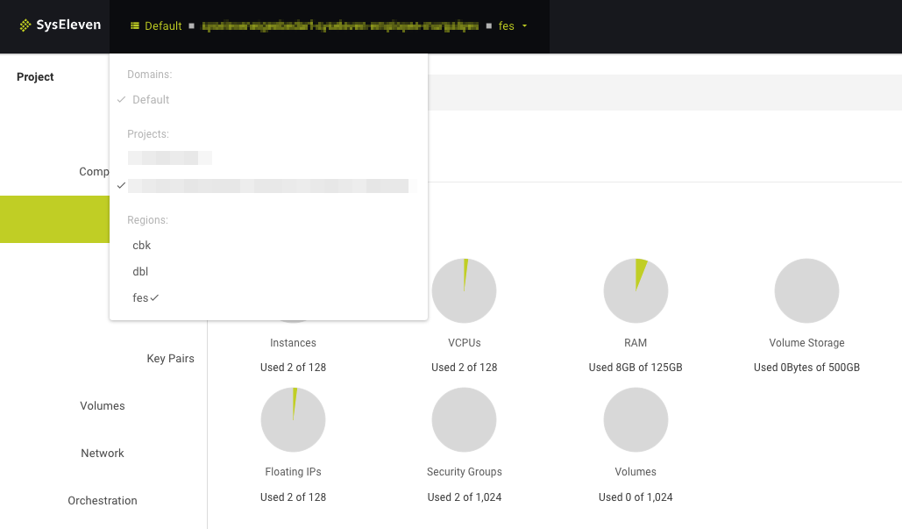

## Overview

* Regions are available to all customers.
* Currently 3 regions are available.
* The dashboard "Overview" shows the resources of the currently selected region.
* Resource limits may vary between regions, in some cases effectively preventing the practical use of (a) region(s).

## Regions

The current 3 regions are:

* `cbk` (Berlin)
* `dbl` (Berlin)
* `fes` (Frankfurt)

Since 2024, a fourth region, `dus2` (Düsseldorf), is visible in the OpenStack catalog but is not yet publicly available.

## Goal

* Select Region via GUI (Horizon)
* Select Region via CLI (OpenStack client)

---

## Select via GUI

### Prerequisites

* You need to have the login data for the SysEleven Stack API (user name and passphrase).

### How to select?

* Log in to the [SysEleven Stack Dashboard](https://cloud.syseleven.de/) using the username and password (API credentials) that were provided by SysEleven.


* In order to select a region via the dashboard, go to the dropdown menu at the top of the dashboard.
* There select the region (cbk / dbl / fes).



Once the region is selected you can start creating resources in that region.

---

## Select via CLI

### Prerequisites

* You need to have the login data for the SysEleven Stack API (user name and passphrase).
* The [OpenStack CLI-Tools](../../03.Howtos/02.openstack-cli/docs.en.md) are installed in an up-to-date version.
* Environment variables are set, like shown in the [API-Access-Tutorial](../../02.Tutorials/02.api-access/docs.en.md).

### How to select?

**The default region is defined in the 'openrc' file** in the environment variable `OS_REGION_NAME`. For your own comfort you can create one 'openrc' file per region and adjust `OS_REGION_NAME` in each file.

Using the username and password (API credentials) that were provided by SysEleven source the 'openrc' file and enable the CLI client to talk to the SysEleven Stack.

When using the openstack client you can select the region by setting the `OS_REGION_NAME` variable accordingly. As an alternative you can override it with the command line option `--os-region-name <region name>`.

**Note:** if you don't specify any region name in the `openrc` file or on the command line, the OpenStack client may pick a region in an unpredictable way, depending on what service you try to use.

The following example shows how to use it:

```shell
# openstack --os-region-name <region name> <openstack sub command>

openstack --os-region-name cbk server list
+--------------------------------------+--------------+--------+-------------------------------------------+-------------------------+----------+
| ID                                   | Name         | Status | Networks                                  | Image                   | Flavor   |
+--------------------------------------+--------------+--------+-------------------------------------------+-------------------------+----------+
| 9cdf2a81-0271-4b6f-aa3e-61asdas51dsa | lampserver   | ACTIVE | lampserver-net=10.0.0.14, 185.56.132.xxx  | Ubuntu Server 22.04 LTS | m1c.tiny |
+--------------------------------------+--------------+--------+-------------------------------------------+-------------------------+----------+

openstack --os-region-name dbl server list
+--------------------------------------+--------------+--------+-------------------------------------------+-------------------------+----------+
| ID                                   | Name         | Status | Networks                                  | Image                   | Flavor   |
+--------------------------------------+--------------+--------+-------------------------------------------+-------------------------+----------+
| 18e28c13-999e-4389-92ce-asd1das1das5 | lampserver   | ACTIVE | lampserver-net=10.0.0.11, 195.192.128.xxx | Ubuntu Server 22.04 LTS | m1c.tiny |
+--------------------------------------+--------------+--------+-------------------------------------------+-------------------------+----------+
```

Once the region is selected you can start using resources via API and templates.
